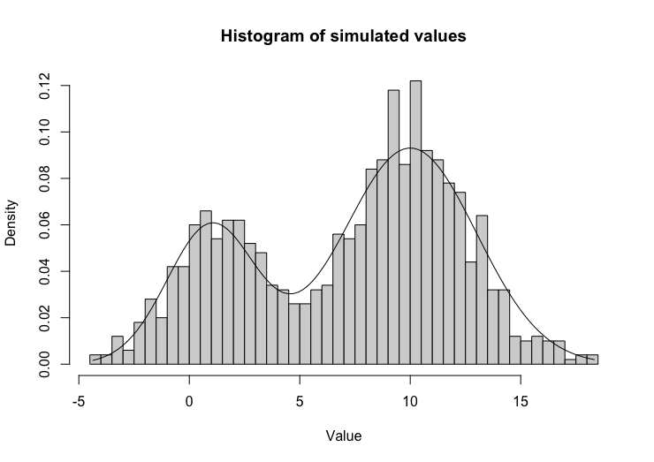
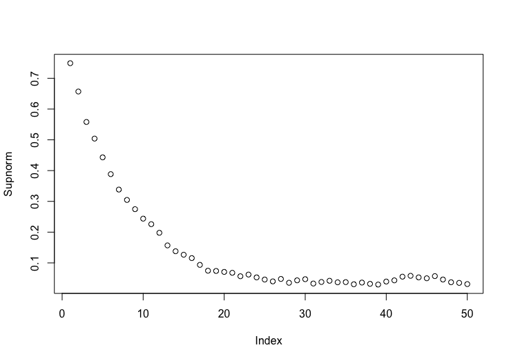

# MCMCMixBimodal

## Introduction

MCMCMixBimodal is a package that allows the user to to generate random variables from from bimodal Densities with highly spaced modes using Metropolis-Hastings Algorithm with a specially customized proposal Density. More specifically, it allows the user to generate random variables from a mixture of two Gaussian Densities by specifying the means and variances of the component normal densities and also the mixing parameter. It also allows the user to study the convergence rate of the algorithm using relevant plots.

<!-- badges: start -->
[](https://github.com/SrijatoBhattacharyya/MCMCMixBimodal/actions/workflows/R-CMD-check.yaml)
[](https://app.codecov.io/gh/SrijatoBhattacharyya/MCMCMixBimodal?branch=main)
<!-- badges: end -->


## Installation

To install MCMCMixBimodal package

``` r
library("devtools")
devtools::install_github("SrijatoBhattacharyya/MCMCMixBimodal")
```

## Example
``` r
library("MCMCMixBimodal")
```
MCMCmixture function simulates random variables from a Univariate
Bimodal Gaussian/Cauchy Mixture Distribution. The means/medians and variances/scale parameters of the 2
Gaussian/Cauchy distributions and the mixing parameter that form the target
mixture distribution will be taken as input from the user, along with
the iteration number of the Markov Chains to be simulated. This function
generates 1000 replications of the markov chain with stationery
distribution as the target distribution, returns the 1000-long vector of
generated values at the final iteration of each chain and plots the
histogram of the values produced.

``` r
MCMCmixture(1, 10, 2, 3, 0.3, 1000, density = "Normal")
```

The histogram of the generated samples:


``` r
MCMCmixture(1, 10, 2, 3, 0.3, 1000, density = "Cauchy")
```
MCMCrate generates 1000 Markov Chain values simultaneously
at each iteration of the Algorithm. These chains have stationery distribution
same as the target mixture distribution and takes same set of inputs as the MCMCmixture function. This function generates Nsim values for each chain. As its output, it will return the Nsim-long vector of supremum of the absolute difference between the empirical CDF of the 1000 generated values of the chain and the actual CDF of the target distribution at each iteration. It will also plot these differences for the first 50 iterations.


``` r
MCMCrate(m1 = 20, m2 = 0, s1 = 1, s2 = 2, alpha = 0.5, Nsim = 1000)
```

The histogram plot of the samples:


``` r
MCMCrate(m1 = 10, m2 = 0, s1 = 2, s2 = 4, alpha = 0.5, Nsim = 1000, density = "Cauchy")
```

## References

W.R. Gilks, S. Richardson, and D.J. Spiegelhalter, ed. (1996), Markov chain Monte Carlo in practice. Chapman and Hall, London.
